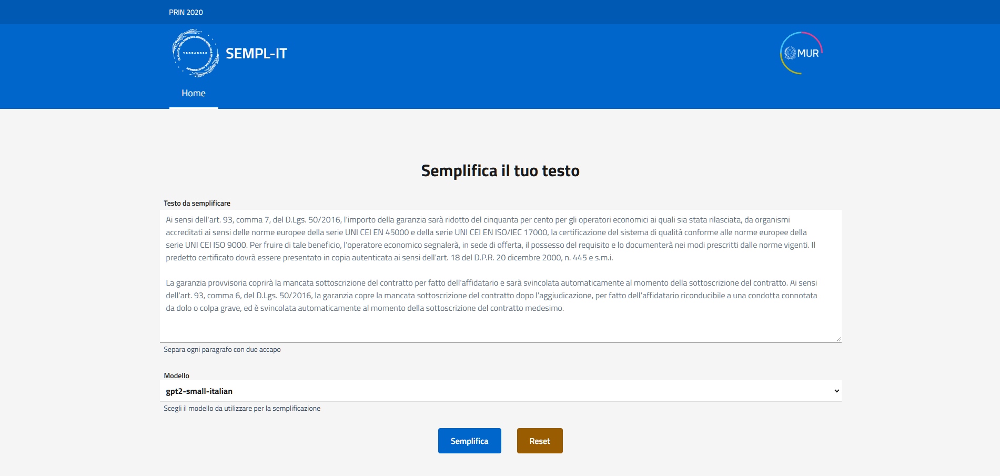
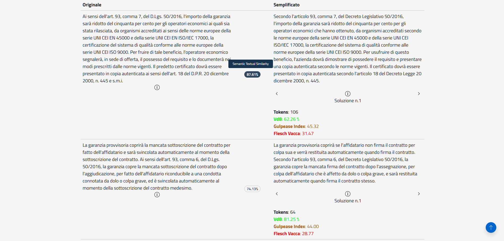

# SEMPL-IT frontend
This is the backend of the SEMPL-IT, a web app designed to simplify Italian administrative document using LLMs.

Check out the [backend](https://github.com/VerbACxSS/semp-it-backend) of the SEMPL-IT web app.

## Getting Started
### Pre-requisites
This web application is developed using Angular framework and Design Angular Kit library. The following software are required to run the application:
* Node (tested on version 20.11.1)
* npm (tested on version 10.5.0)

Alternatively, you can use a containerized version by installing:
* Docker (tested on version 27.3.1)

### Using `node` and `npm`
Install the dependencies
```sh
npm install
```

Run the application
```sh
npm run serve-local
```

### Using `docker`
Run the application using `docker compose`
```sh
docker compose up --build -d
```

## Usage
The web application will be running at `http://localhost:8080`.


The user can write an Italian administrative text, select the model and click on the "Semplifica" button. 


The text will be simplified using the selected model one paragraph at a time. The model will generate multiple simplified versions of the paragraph. Simplification metrics will be displayed for each paragraph.

## SEMPL-IT fine-tuned models
The SEMPL-IT interacts with three different fine-tuned models available on Hugging Face perform text simplification tasks. The models are:
* `sempl-it-mt5-small`: https://huggingface.co/VerbACxSS/sempl-it-mt5-small
* `sempl-it-umt5-small`: https://huggingface.co/VerbACxSS/sempl-it-umt5-small
* `sempl-it-gpt2-small-italian`: https://huggingface.co/VerbACxSS/sempl-it-gpt2-small-italian

## Built With
* [Angular](https://angular.io/)
* [Design Angular Kit](https://github.com/italia/design-angular-kit/)

## License
This project is licensed under the MIT License - see the [LICENSE](LICENSE) file for details.

## Acknowledgements
This contribution is a result of the research conducted within the framework of the PRIN 2020 (Progetti di Rilevante Interesse Nazionale) "VerbACxSS: on analytic verbs, complexity, synthetic verbs, and simplification. For accessibility" (Prot. 2020BJKB9M), funded by the Italian Ministero dell'Università e della Ricerca.

## How to cite us
Vittorio Ganfi e Marco Russodivito (2025). SEMPL-IT: un modello di intelligenza artificiale per la semplificazione dell'italiano. In *Giuliana Fiorentino, Alessandro Cioffi, Maria Ausilia Simonelli (a cura di), AMMINISTRAZIONE ATTIVA. Semplicità e chiarezza per la comunicazione amministrativa (Quaderni della Rassegna, 254). Firenze: Franco Cesati Editore. ISBN 979-12-5496-268-8*.

```bibtex
@inproceedings{ganfi2025semplit,
  title     = {SEMPL-IT: un modello di intelligenza artificiale per la semplificazione dell'italiano},
  author    = {Ganfi, Vittorio AND Russodivito, Marco},
  booktitle = {AMMINISTRAZIONE ATTIVA. Semplicità e chiarezza per la comunicazione amministrativa},
  editor    = {Fiorentino, Giuliana AND Cioffi, Alessandro AND Simonelli, Maria Ausilia},
  series    = {Quaderni della Rassegna},
  volume    = {254},
  publisher = {Franco Cesati Editore},
  address   = {Firenze},
  year      = {2025},
  isbn      = {979-12-5496-268-8}
}
```
